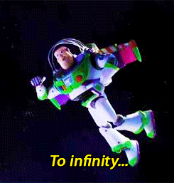

Pourquoi tester un animation ?
==============================

+ Tests de non régression uniquement (**Pas de TDD**).
---
+ Dans les faits, une validation humaine est peut être plus pertinente...
+ Envisager l'automatisation des tests d'animations :
	+ sur des **animations critiques** (UX)
	+ sur une **librairie de composants**
---
+ Pour le challenge et pour **repousser les limites de ce qui est testable...**

