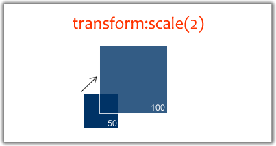
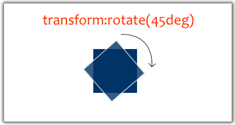
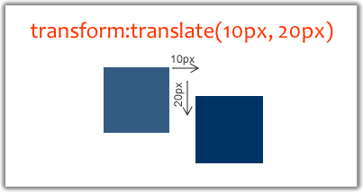

Des animations à 60fps ?
========================

+ Les propriétés animées sont plus importantes que le fait d'utiliser du CSS ou du JS
+ Les propriétés **transform** et **opacity** peuvent être utilisés sans craintes.
+ Avec transform, on peut:

| **Scale** | **Rotate** | **Translate** |
| --------- | ---------- | ------------- |
|  |  |  |
